# API REST con Flask - Ejercicios Prácticos

Este repositorio contiene la serie de ejercicios prácticos realizados para aprender y dominar la creación de APIs RESTful utilizando **Python, Flask y PostgreSQL**. 

A lo largo de estos ejercicios, se implementaron desde operaciones CRUD básicas hasta sistemas de seguridad avanzados y documentación automática, sentando las bases para proyectos a mayor escala (como sistemas de geolocalización o rastreo de transporte).

---

## Tecnologías Utilizadas
* **Backend:** Python, Flask
* **Base de Datos:** PostgreSQL, SQLAlchemy (ORM)
* **Seguridad:** Flask-JWT-Extended (JSON Web Tokens)
* **Documentación:** Flasgger (Swagger UI)
* **Testing:** Postman

---

## Ejercicios Realizados

### Ejercicio 1: Configuración Inicial y Estructura
Configuración del entorno virtual, conexión a la base de datos PostgreSQL utilizando el patrón *Application Factory* de Flask.
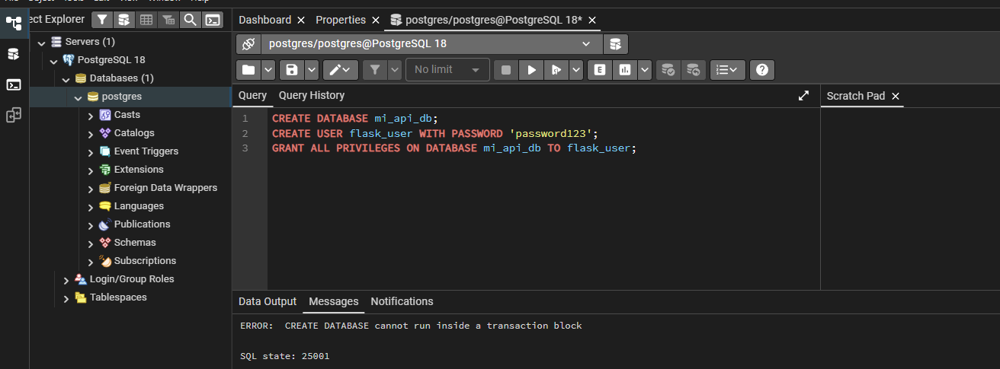
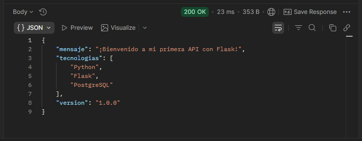*

### Ejercicio 2: Modelos y Operaciones CRUD
Creación del modelo `Estudiante` y desarrollo de los endpoints para las operaciones de Crear, Leer, Actualizar y Eliminar (CRUD).
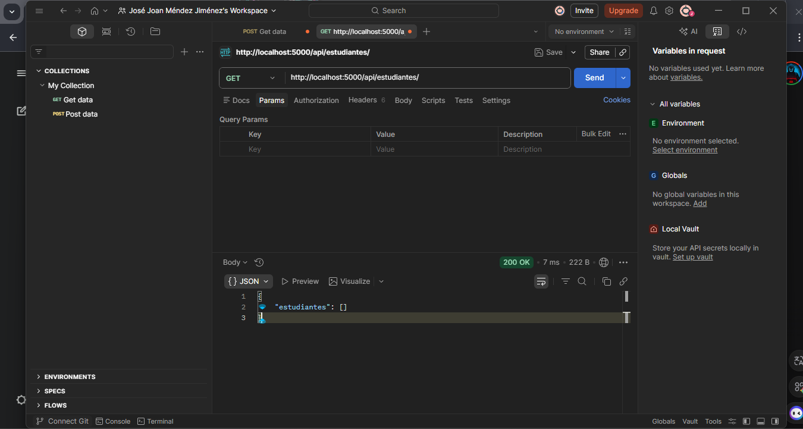
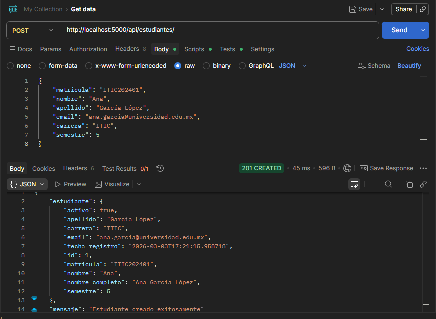
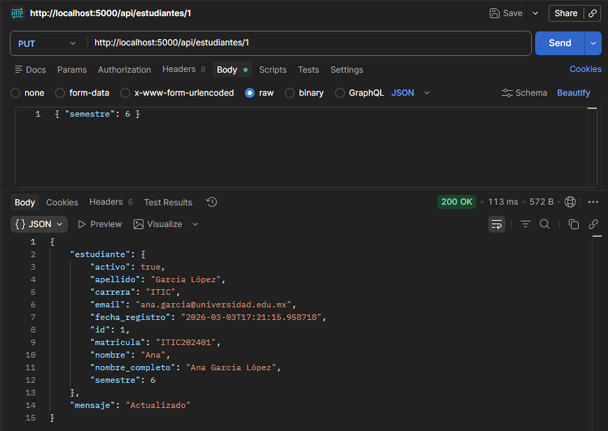

### Ejercicio 3: Relaciones entre Tablas (Kardex)
Implementación de llaves foráneas y relaciones complejas (Estudiantes, Materias y Calificaciones) para generar un Kardex con cálculos matemáticos automáticos.
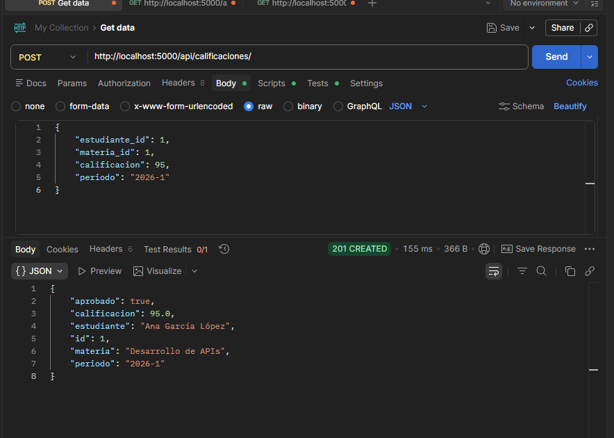
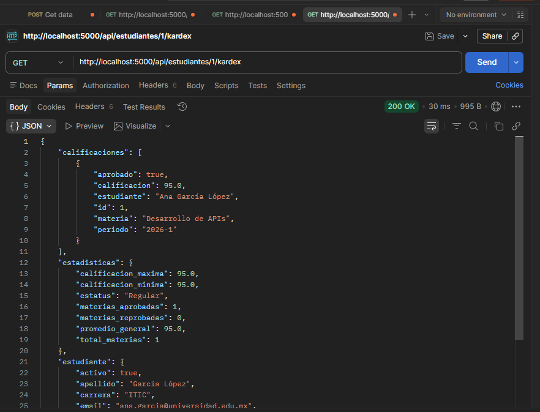
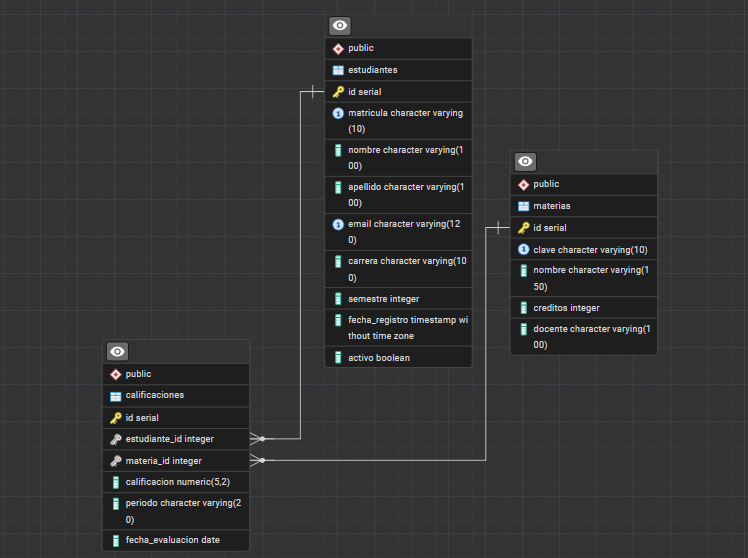

### Ejercicio 4: Autenticación con JWT
Protección de rutas de la API mediante la generación y validación de JSON Web Tokens (JWT). Implementación de rutas de registro, login y perfil protegido.

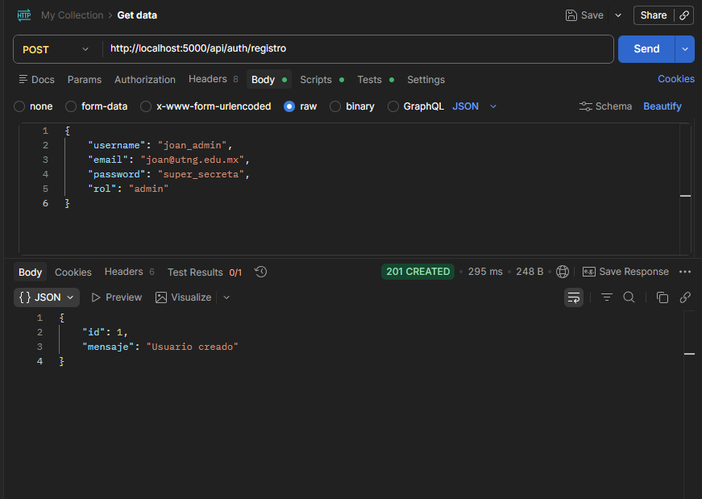
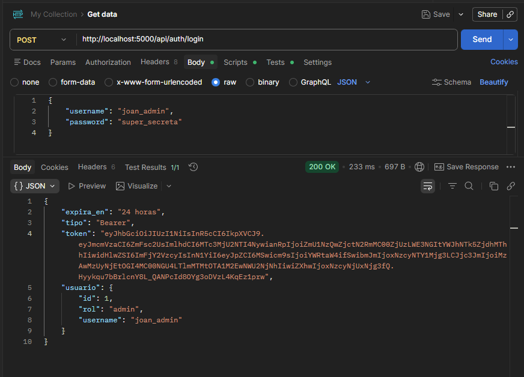
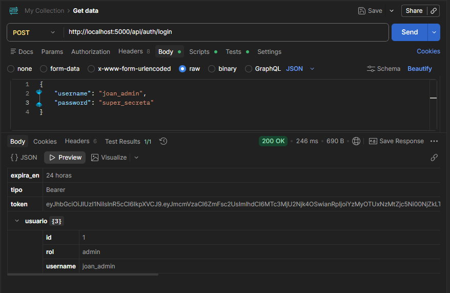
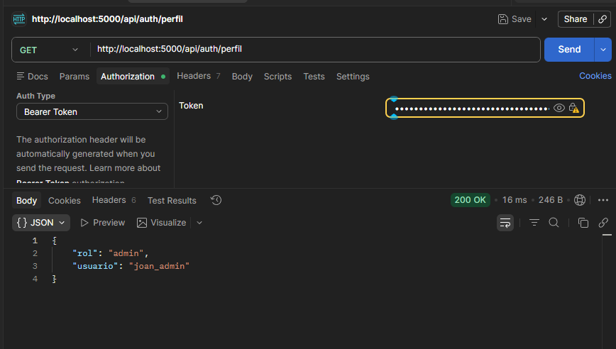
### Ejercicio 5: Documentación Interactiva con Swagger
Integración de Flasgger para auto-generar la documentación de la API, permitiendo realizar pruebas directas desde el navegador.

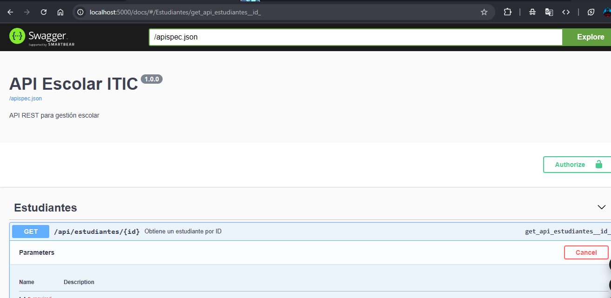
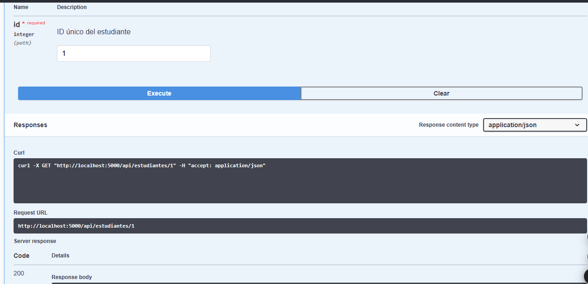
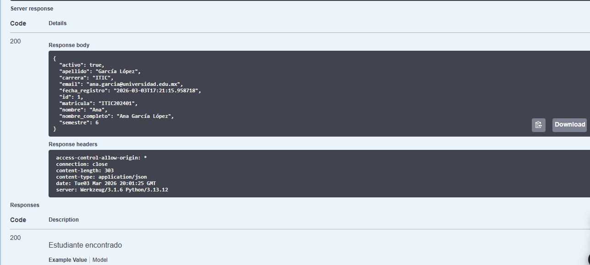

---

## Proyecto Final: TechStore API (Nivel Jefe)
Implementación de un endpoint complejo con transacciones atómicas (`commit` y `rollback`) para procesar órdenes de compra, verificando inventario y descontando stock en tiempo real.

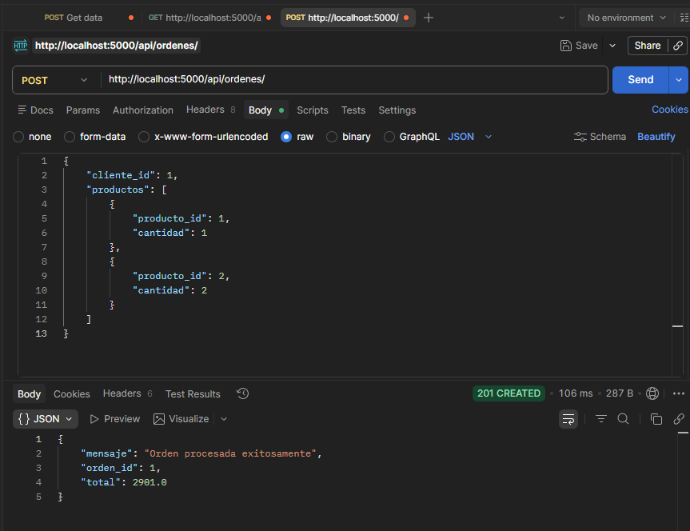
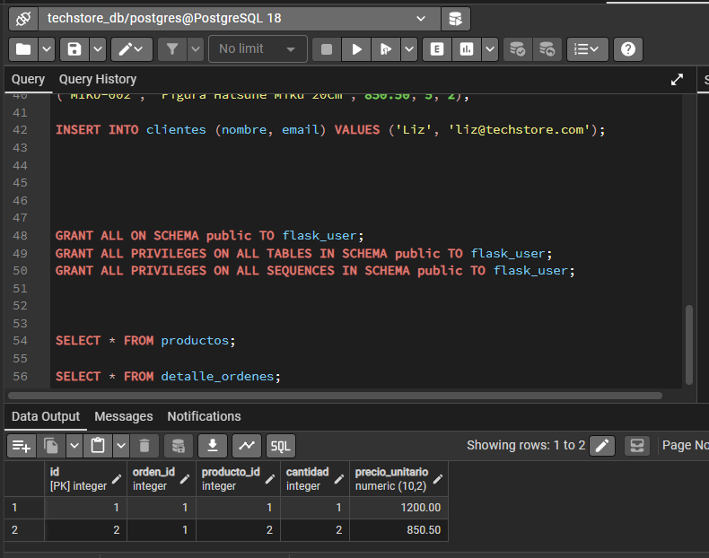

